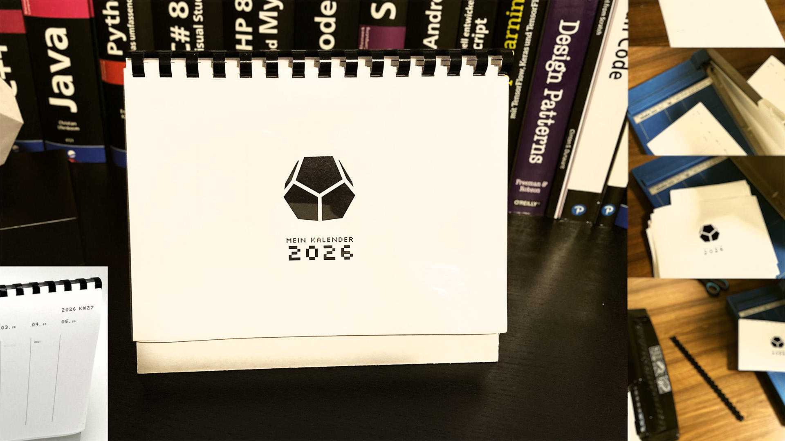

# Calendar Creator

Dieses Python-Skript erstellt einen Kalender im A5-Querformat mit steirischen Feiertagen und personalisierten Terminen zum selber basteln.



## 🚀 Features
- Vollständiger Kalender für das definierte Jahr mit Kalenderwochen
- Automatische Berechnung von Ostern und beweglichen Feiertagen
- Steirische Feiertage
- Personalisierte Termine aus CSV-Datei
- A5- und A4-PDF-Ausgabe mit Template-Design
- Pixel-font und Logo-Integration

## 📋 Voraussetzungen
```bash
pip install pymupdf
```
- **font/Silkscreen-Regular.ttf** (Pixel-Font)
- **logo/logo.png** (Dein Logo, Empfehlung: 40x40 mm 300 DPI)
- **template/Template.pdf** (Hintergrund-Template)
- **data/special-dates.csv** (Format: `"MM-DD","Termin1:Termin2"`)

## ⚙️ Quickstart
```bash
git clone https://github.com/richardreinisch/calendarcreator
cd calendarcreator
```
Create and source virtual environment.
```bash
pip install -r requirements.txt
python main.py
```

**Ausgabe:**
- `output/Mein_Kalender_2026_A5.pdf`
- `output/Mein_Kalender_2026_A4.pdf`

## 🗓️ Beispiel special-dates.csv
```csv
"03-11","Neo"
"03-29","Terence"
"05-26","Papierflieger"
"10-31","Bud"
```

## 📁 Verzeichnisstruktur
```
project/
├── font/
│   └── Silkscreen-Regular.ttf
├── logo/
│   └── logo.png
├── template/
│   └── Template.pdf
├── data/
│   └── special-dates.csv
├── main.py
└── output/
    ├── Mein_Kalender_2026_A5.pdf
    └── Mein_Kalender_2026_A4.pdf
```

## 🔧 Anpassungen
- **Jahr ändern:** `YEAR = 2027`
- **Feiertage:** `get_styrian_holidays()` erweitern
- **Design:** Positionen in `mm_to_points()` anpassen
- **Font/Logo:** Pfade in Konstanten ändern

## 🐛 Fehlerbehebung
| Problem | Lösung |
|---------|--------|
| "Logo not found" | Logo in `logo/` platzieren |
| "Template not found" | PDF-Template erstellen |
| Feiertage fehlen | `get_styrian_holidays()` prüfen |
| Schriftart fehlt | Silkscreen TTF herunterladen |

***

Built with ❤️  

